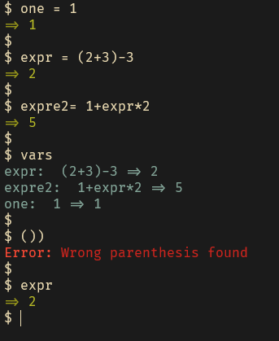

# 📖 Description
**A multithreaded calculator [REPL](https://en.wikipedia.org/wiki/Read%E2%80%93eval%E2%80%93print_loop) written in Rust mainly for learning reason**<br>

**The expression evaluation is follows the following precedence (1 is the highest priority)**<br>
| Operator | Priority |
| :- | :-: |
| `Fact` | 1 |
| `Exp`, `Sqrt` | 2 |
| `Div`, `Mul`, `Mod` | 3 |
| `Add`, `Sub` | 4 |
| `Equal`, `Not`, `Not Equal` | 5 |
| `Greater Than`, `Less Than`, `Greater Equal`, `Less Equal` | 6 |
| `Logical And`, `Bitwise And` | 7 |
| `Logical Or`, `Bitwise Or`, `Logical Xor`, `Bitwise Xor` | 8 |
**The variables inside the expression have the highest priority**

**The parenthesis is matter!**<br>

**🆕Variables Added**<br>

**⚠️Working with Nightly toolcahin**<br>

## ⬇️ Installation
[0.1 "Iterative" version](https://github.com/domonkosgyomorey/REPL_calculator/releases/tag/0.1)<br>
[0.2 Expression Tree version](https://github.com/domonkosgyomorey/REPL_calculator/releases/tag/0.2)<br>
[0.3 Functional Multithreaded REPL Calculator With Many Operators](https://github.com/domonkosgyomorey/REPL_calculator/releases/tag/0.3)

## Expression Solving recipe
- Own "Input cleaner", "Tokenizer", "Lexer"<br>
- [Shunting Yard algorithm](https://en.wikipedia.org/wiki/Shunting_yard_algorithm) for converting expression into infix form<br>
- Generating [Expression Tree](https://en.wikipedia.org/wiki/Binary_expression_tree) from infix expression form<br>

## ☀️ Supported Features
- ✅ Variables Added
- ✅ Unsigned 32 bit integer ( Overflow and Underflow are permitted due Rust Wrapping)
- ✅ Multithreaded AST solver
- ✅ Boolean ( If > 0 Than True otherwise its False )
- ✅ Addition
- ✅ Subtraction
- ✅ Multiplication
- ✅ Division (On Divided by Zero print Error)
- ✅ Exponents
- ✅ Square root
- ✅ Factorial
- ✅ Mod
- ✅ Logical operators
- ✅ Equality operators
- ✅ Nice error handling
- ✅ Logging ( Log different state of the program during the expression solving into log.txt)
- ✅ Parentheses matter in the evaluation of the expression
- ✅ A handy REPL
- ✅ Automatic test

## Operators
| Name | Operator | Arg number | Return type |
| :- | :-: | :-: | :- |
| Addition | `+` | 2 | u32 |
| Subtract | `-` | 2 | u32 |
| Multiply | `*` | 2 | u32 |
| Divide | `/` | 2 | u32 |
| Exponent | `**` | 2 | u32 |
| Factorial | `!` | 1 | u32 |
| Square root | `@` | 1 | u32 |
| Mod | `%` | 2 | u32 |
| Equals | `==` | 2 | bool |
| Logical NOT | `~` | 1 | bool |
| Not equal | `~=` | 2 | bool |
| Logical OR | `\|\|` | 2 | bool |
| Bitwise OR | `\|` | 2 | bool |
| Logical AND | `&&` | 2 | bool |
| Bitwise AND | `&` | 2 | bool |
| Logical XOR | `^^` | 2 | bool |
| Bitwise XOR | `^` | 2 | bool |
| Greater Than | `>` | 2 | bool |
| Greater Equal | `>=` | 2 | bool |
| Less Than | `<` | 2 | bool |
| Less Equal | `<=` | 2 | bool |

## 📷 Preview


## Building
Install and switch toolchain to nightly
```console
rustup toolchain install nightly
rustup default nightly

```

Build and run
```console
cargo build
cargo run
```

## 📦 Dependencies
- [lazy_static](https://crates.io/crates/lazy_static)
- [rayon](https://crates.io/crates/rayon)
- rustup and nightly toolchain

## 🧪 Tested On
x86_64 Windows
