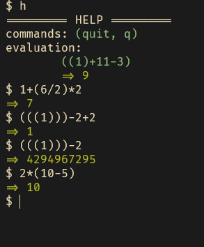
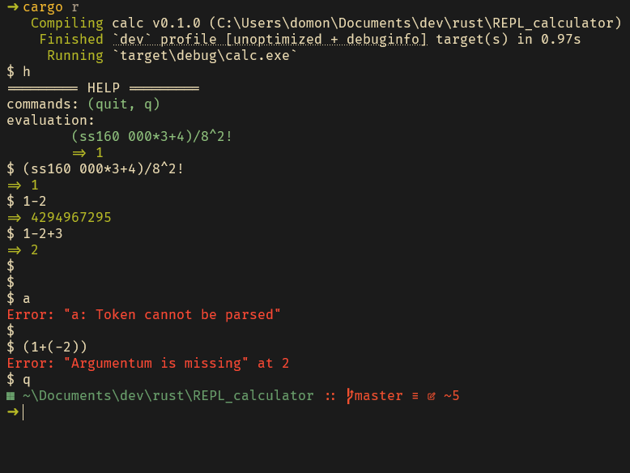

# 📖 Description
**A calculator [REPL](https://en.wikipedia.org/wiki/Read%E2%80%93eval%E2%80%93print_loop) written in Rust mainly for learning reason**<br>

The expression evaluation is follows the following precedence<br>
**( SQRT , EXP ) > ( MUL , DIV ) > ( ADD , SUB )**<br>

**The parenthesis is matter!**<br>

**🆕Booleans and booleans operators added**<br>

**⚠️Working with Nightly toolcahin**<br>

## ⬇️ Installation
[0.1 "Iterative" version](https://github.com/domonkosgyomorey/REPL_calculator/releases/tag/0.1)<br>
[0.2 Expression Tree version](https://github.com/domonkosgyomorey/REPL_calculator/releases/tag/0.2)

## Expression Solving recipe
- Own "Input cleaner", "Tokenizer", "Lexer"<br>
- [Shunting Yard algorithm](https://en.wikipedia.org/wiki/Shunting_yard_algorithm) for converting expression into infix form<br>
- Generating [Expression Tree](https://en.wikipedia.org/wiki/Binary_expression_tree) from infix expression form<br>

## ☀️ Supported Features
- ✅ unsigned 32 bit integer ( Overflow and Underflow are permitted due Rust Wrapping)
- ✅ Boolean ( If > 0 Than True otherwise its False )
- ✅ Addition
- ✅ Subtraction
- ✅ Multiplication
- ✅ Division (On Divided by Zero print Error)
- ✅ Exponents
- ✅ Square root
- ✅ Factorial
- ✅ Mod
- ✅ Logical operators
- ✅ Equality operators
- ✅ Nice error handling
- ✅ Logging ( Log different state of the program during the expression solving into log.txt)
- ✅ Parentheses matter in the evaluation of the expression
- ✅ A handy REPL
- ✅ Automatic test

## Operators
| Name | Operator |
| - | :-: |
| Addition | `+` |
| Subtract | `-` |
| Multiply | `*` |
| Divide | `/` |
| Exponent | `**` |
| Factorial | `!` |
| Square root | `s` |
| Mod | `%` |
| Equals | `==` |
| Logical NOT | `n` |
| Not equal | `n=` |
| Logical OR | `\|\|` |
| Bitwise OR | `\|` |
| Logical AND | `&&` |
| Bitwise AND | `&` |
| Logical XOR | `^^` |
| Bitwise XOR | `^` |
| Greater Than | `>` |
| Greater Equal | `>=` |
| Less Than | `<` |
| Less Equal | `<=` |

## 📷 Preview



## Building
Install and switch toolchain to nightly
```console
rustup toolchain install nightly
rustup default nightly

```

Build and run
```console
cargo build
cargo run
```

## 📦 Dependencies
- [lazy_static](https://crates.io/crates/lazy_static)
- [rayon](https://crates.io/crates/rayon)
- rustup and nightly toolchain

## 🧪 Tested On
x86_64 Windows
